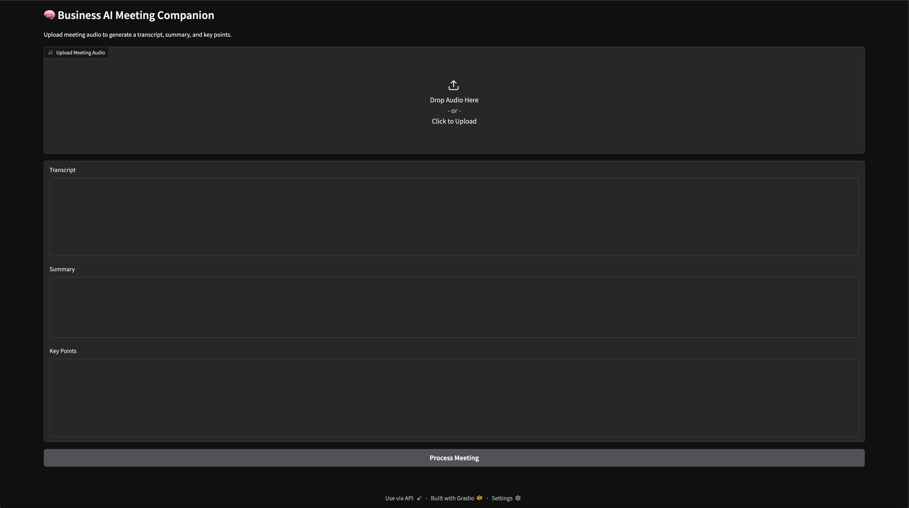

# 🧠 Business AI Meeting Companion

An end-to-end AI-powered web app that transcribes meeting audio and generates concise summaries and key insights.

Built with Whisper, Hugging Face Transformers, and Gradio.

---

## 🚀 Features

- 🎙️ Upload meeting audio (MP3, WAV, etc.)
- 📝 Automatic speech-to-text transcription using Whisper
- 📄 Concise meeting summary generation
- 📌 Extracted key points / highlights
- ⚡ Fast local inference (runs on your machine)

---

## 🖼️ Demo



---

## 🧩 Tech Stack

- **Python**
- **Gradio** – UI interface
- **OpenAI Whisper** – speech-to-text
- **Hugging Face Transformers**
  - `facebook/bart-large-cnn` (summarization)
- **PyTorch**

---

## ⚙️ Installation

### 1. Clone the repository

```bash
git clone https://github.com/arnieldon-hub/ai-meeting-companion.git
cd ai-meeting-companion
```

### 2. Create a virtual environment

```bash
python3 -m venv venv
source venv/bin/activate
```

### 3. Install dependencies

```bash
pip install -r requirements.txt
```

### 4. Install FFmpeg (required for audio processing)

```bash
brew install ffmpeg
```

---

## ▶️ Run the App

```bash
./venv/bin/python3 app.py
```

Then open:

```
http://127.0.0.1:7860
```

---

## 📌 How It Works

1. Audio is uploaded via the Gradio interface  
2. Whisper transcribes the audio into text  
3. BART generates a concise summary  
4. Key points are extracted from the transcript  
5. Results are displayed instantly in the UI  

---

## ⚠️ Notes

- First run may take longer due to model downloads  
- Works best with clear speech audio  
- Key points are extractive (based on transcript sentences)  

---

## 📈 Future Improvements

- Speaker diarization (who said what)  
- Real-time transcription  
- Improved key point extraction with LLMs  
- Export to PDF / meeting notes  
- Cloud deployment  

---

## 📄 License

MIT License
